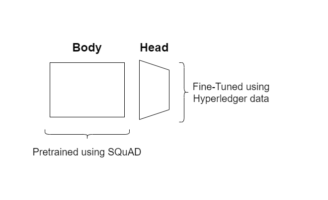
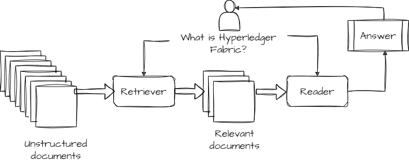

# Hyperledger QA PoC

This is a Proof-of-Concept application that allows you to ask questions to a python script chatbot, fine-tuned with Hyperledger Standard Documents.
I implemented this first version, as mentee, during the Hyperledger Mentorship Program 2023.

## Use case

This NLP application allows people to access to the Hyperledger Standard Documentation.
The scope of the lab is to support the Hyperledger users (users, developer, etc.) to their work, avoiding to wade through oceans of documents to find information they are looking for. Large Language Models have yielded remarkable results, either pay and open source tools. Today we can implement a conversational AI tool which replies to questions related to specific context.

## Architecture

The model is XML-R pre-trained ([HuggingFace deepset/xlm-roberta-large-squad2](https://huggingface.co/deepset/xlm-roberta-large-squad2)) with SQuAD Dataset. Below the architecture of the model:\

## Pipeline

In this PoC I use Haystack ([Haystack by Deepset](https://haystack.deepset.ai/)) to Build the QA pipeline.
Below an image of the architecture:\

I use Elastic Search ([Elastic Search website](https://www.elastic.co/)) as Retriever component.

## Installation

For the installation istructions read the links below:\
[Haystack installation](https://haystack.deepset.ai/integrations/elasticsearch-document-store)

[Elastic Search Windows installation](https://www.elastic.co/guide/en/elasticsearch/reference/current/zip-windows.html)

## Ingestion files

In ingest folder, you can find two kinds of files:

1. es format (Elastic Search) which contains data for the unstructured documents
2. one squad format file ([Stanford Question Anwsering Dataset](https://huggingface.co/datasets/squad_v2)) for the fine-tuning process

## Current version notes

That is the first version of a PoC. Below a list of improvements that will be applied soon:

1. Model: more sophisticated model (e.g. Zephyr 7B alpha)
2. Dataset: currently I implemented only 2 documents as example, but real systems work with hundreds of documents
3. Retriever: more sophisticated techniques use embeddings
4. QA type: I will use generative (RAG) instead of extractive QA
5. Hardware: now the system requires 10 minutes to ingest the files, GPU can help to save much time
