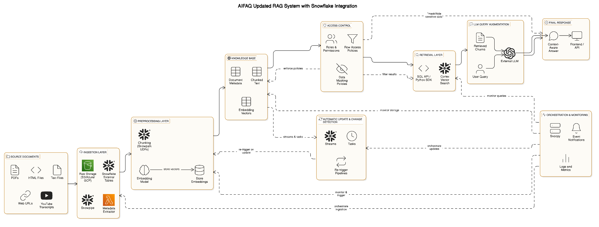

# Snowflake Branch: Hyperledger Labs AIFAQ prototype


[](https://github.com/hyperledger-labs/aifaq/stargazers)
[](https://github.com/hyperledger-labs/aifaq/network/members)
[](https://github.com/hyperledger-labs/aifaq)
[](https://github.com/hyperledger-labs/aifaq/issues)
[](https://github.com/hyperledger-labs/aifaq/pulls)


---
## 🚀 Overview

The **Hyperledger Labs AIFAQ Prototype** is an open-source conversational AI tool designed to answer questions from technical documentation, FAQs, and internal knowledge bases with high accuracy and context awareness. This implementation of AIFAQ integrates deeply with **Snowflake**, providing secure multi-user support, persistent chat history, and access to powerful LLMs like OpenAI, Anthropic, and Snowflake Cortex.

👉 Official Wiki Pages:

- [Hyperledger Labs Wiki](https://lf-hyperledger.atlassian.net/wiki/spaces/labs/pages/20290949/AI+FAQ+2025)

👉 Weekly Community Calls:

- Every Monday (public) — join via [Hyperledger Labs Calendar](https://wiki.hyperledger.org/display/HYP/Calendar+of+Public+Meetings).

---
## Features

- User Authentication: Secure, multi-user access with isolated document and chat histories
- LLM Integration: Seamless access to Cortex, OpenAI, and Anthropic models via Snowflake external functions
- Multi-Document Support: Upload and query multiple documents per session
- Persistent Chat History: Retrieve and continue conversations across sessions
- Streamlit UI: Intuitive document upload and chat interface

---
## 🛠️ Architecture



1. Flexible Document Ingestion: AIFAQ supports various source formats (PDFs, HTML, YouTube transcripts, etc.) ingested into Snowflake via external tables, raw storage, and pipelines using tools like Snowpipe and Lambda-based metadata extractors.
2. Preprocessing & Embedding: Documents are chunked using Snowpark UDFs and embedded using LLM-based models. Embedding vectors are stored in Snowflake, forming the searchable knowledge base alongside metadata.
3. Access Control & Governance: Fine-grained access is enforced through Snowflake's role-based permissions, row-level security, and data masking policies to protect sensitive content.
4. LLM Query Augmentation & Retrieval: User queries are augmented with context by retrieving relevant chunks from the vector database (via Cortex Vector Search or SQL API), then sent to external LLMs (OpenAI, Anthropic) for response generation.
5. Automation & Monitoring: Updates to documents automatically re-trigger embedding pipelines using Snowflake Streams and Tasks, while monitoring tools like Snoopy and event notifications ensure system observability and orchestration.

---
## 📝 Setup Instructions (Snowflake Branch)
Follow these steps to configure your Snowflake environment using the provided `setup.sql` script.

1. Set up a role for the chatbot and grant access to required resources:

```
CREATE OR REPLACE ROLE chatbot_user;

GRANT USAGE ON WAREHOUSE compute_wh TO ROLE chatbot_user;
GRANT USAGE ON DATABASE llm_chatbot TO ROLE chatbot_user;

```
2. Initialize the database and schema for storing documents and chat data:

```
CREATE OR REPLACE DATABASE llm_chatbot;
CREATE OR REPLACE SCHEMA chatbot;
USE SCHEMA llm_chatbot.chatbot;

```
3. Create two core tables, one for document chunks and another for chat history:

```
CREATE OR REPLACE TABLE documents (
  user_id STRING,
  doc_id STRING,
  doc_name STRING,
  chunk_id STRING,
  chunk_text STRING,
  embedding VECTOR(FLOAT, 1536)
);

CREATE OR REPLACE TABLE chat_history (
  user_id STRING,
  session_id STRING,
  doc_id STRING,
  turn INT,
  user_input STRING,
  bot_response STRING,
  timestamp TIMESTAMP
);
```
4. External Function – OpenAI: Create an external function to call OpenAI's API:

```
CREATE OR REPLACE EXTERNAL FUNCTION openai_complete(prompt STRING)
RETURNS STRING
API_INTEGRATION = my_api_integration
HEADERS = (
  "Authorization" = 'Bearer <OPENAI_API_KEY>',
  "Content-Type" = 'application/json'
)
URL = 'https://api.openai.com/v1/completions'
POST_BODY = '{
  "model": "gpt-3.5-turbo-instruct",
  "prompt": "' || prompt || '",
  "max_tokens": 200
}';

```
> Replace <OPENAI_API_KEY> with your actual OpenAI API key.

5. External Function – Anthropic: Similarly, set up a function to call Anthropic's Claude model:

```
CREATE OR REPLACE EXTERNAL FUNCTION anthropic_complete(prompt STRING)
RETURNS STRING
API_INTEGRATION = my_api_integration
HEADERS = (
  "x-api-key" = '<ANTHROPIC_API_KEY>',
  "Content-Type" = 'application/json'
)
URL = 'https://api.anthropic.com/v1/complete'
POST_BODY = '{
  "model": "claude-3-opus-20240229",
  "prompt": "Human: ' || prompt || '\nAssistant:",
  "max_tokens": 200
}';

```
> Replace <ANTHROPIC_API_KEY> with your actual key.

6. Deploy the chatbot interface using the Streamlit app stored in your project:

```
CREATE OR REPLACE STREAMLIT chatbot_ui
FROM '/chatbot_app'
MAIN_FILE = '/app.py';
```

--- 

## 🌐 Open Source License

- **License:** Apache 2.0 (see [`LICENSE`](./LICENSE) and [`NOTICE`](./docs/NOTICE))
- **3rd Party Libraries:** [ASF 3rd Party License Policy](https://www.apache.org/legal/resolved.html)
- **License Assembly:** [Assembling LICENSE and NOTICE](https://infra.apache.org/licensing-howto.html#mod-notice)


## 🤝 Contributing

We welcome contributions! Please check our [CONTRIBUTING](./docs/CONTRIBUTING.md) guidelines and [Antitrust Policy and Code of Conduct](https://lf-hyperledger.atlassian.net/wiki/spaces/HIRC/pages/19169404/Anti-trust+Policy+Notice+Code+of+Conduct).


## 📆 Join Us!

Join our weekly public calls every Monday! See the [Hyperledger Labs Calendar](https://wiki.hyperledger.org/display/HYP/Calendar+of+Public+Meetings) for details.


## 📢 Stay Connected

- [Slack Discussions](https://join.slack.com/t/aifaqworkspace/shared_invite/zt-337k74jsl-tvH_4ct3zLj99dvZaf9nZw)
- [Hyperledger Labs Community](https://lf-hyperledger.atlassian.net/wiki/spaces/labs/pages/20290949/AI+FAQ+2025)
- Official Website: [aifaq.pro](https://aifaq.pro)
