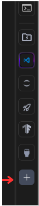
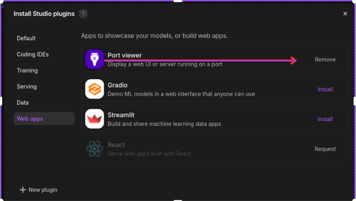
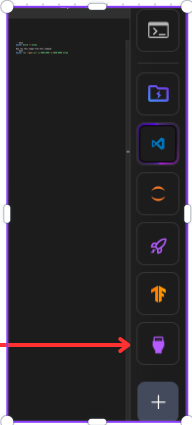
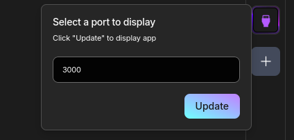

```bash
docker build -t aifaq .
```
Now run this image from this command
```bash
docker run --gpus all -p 3000:3000 -p 8080:8080 aifaq
```

### To check the frontend running on the lightining ai studio.
1. Click on this add icon.



2. Install the web port from here .



3. Now click on this icon.



4. Now update the port 3000 in here.



### The Backend can be checked using this curl request on the new terminal by this curl request.

```console
curl --header "Content-Type: application/json" --request POST --data '{"text": "How to install Hyperledger fabric?"}' http://127.0.0.1:8080/query
```